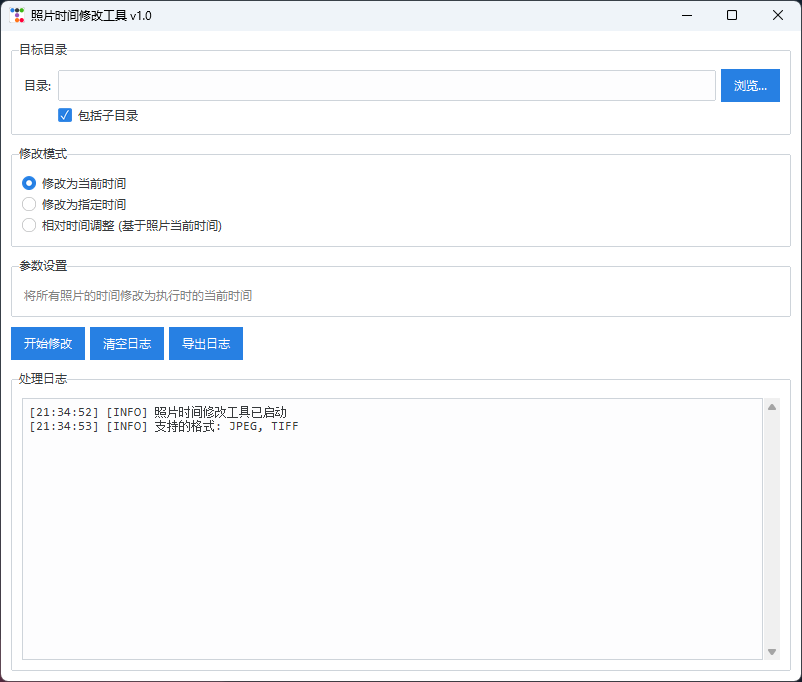

# 照片时间修改工具

一个用Python开发的照片拍摄时间批量修改工具，支持修改照片的EXIF元数据和文件系统时间戳。

## 功能特点

- ✅ **批量处理**: 支持选择目录，自动遍历所有子目录中的照片
- ✅ **多种修改模式**:
  - 修改为当前时间
  - 修改为指定时间（图形化日期时间选择器）
  - 相对时间调整（基于照片当前时间增加/减少）
- ✅ **完整的时间修改**:
  - 修改EXIF元数据（DateTimeOriginal, DateTimeDigitized, DateTime）
  - 修改Windows文件系统时间戳（创建时间、修改时间、访问时间）
- ✅ **友好的GUI界面**: 基于tkinter/ttkbootstrap的现代化界面
- ✅ **实时日志**: 显示处理进度和结果，支持导出日志
- ✅ **独立可执行文件**: 可打包为单个exe文件，无需Python环境

## 界面预览



## 支持的格式

- JPEG (.jpg, .jpeg, .jpe, .jfif)
- TIFF (.tiff, .tif)

## 系统要求

- Windows 10/11
- Python 3.8+ (源码运行时需要)

## 安装和使用

### 方法1: 使用可执行文件（推荐给普通用户）

1. 下载 `PhotoTimeTool.exe`
2. 双击运行即可，无需安装

### 方法2: 从源码运行（开发者）

1. **克隆或下载项目**

   ```bash
   git clone <repository_url>
   cd photo_time_tool
   ```

2. **安装依赖**

   ```bash
   pip install -r requirements.txt
   ```

3. **运行程序**

   ```bash
   python main.py
   ```

## 使用说明

### 基本流程

1. **选择目录**: 点击"浏览..."按钮选择包含照片的目录
2. **选择是否包含子目录**: 勾选"包括子目录"会递归处理所有子文件夹
3. **选择修改模式**:
   - **当前时间**: 将所有照片时间改为运行时的当前时间
   - **指定时间**: 使用日期时间选择器设置具体的时间
   - **相对时间调整**: 输入时间偏移量（例如：+3天、-2小时）
4. **点击"开始修改"**: 确认后开始批量处理
5. **查看日志**: 实时显示处理进度和结果

### 示例场景

#### 场景1: 修正相机时间错误

如果相机时间设置错误（例如慢了2小时），可以使用相对时间调整:

- 选择"相对时间调整"
- 设置: 0天、2小时、0分钟
- 这样会给所有照片的时间加上2小时

#### 场景2: 统一活动照片时间

如果想将某个活动的照片都设置为活动开始时间:

- 选择"指定时间"
- 使用日期时间选择器设置具体时间
- 所有照片会被设置为同一时间

#### 场景3: 更新为当前时间

如果需要让照片显示为最近修改:

- 选择"当前时间"
- 直接开始处理即可

## 注意事项

⚠️ **重要提醒**:

- 本工具会直接修改照片文件，**建议先备份重要照片**
- 修改操作不可撤销（程序不提供撤销功能）
- 建议先用少量照片测试，确认效果后再批量处理
- 只读文件会自动尝试移除只读属性，但如果权限不足仍会失败

### 已知限制

- 仅支持JPEG和TIFF格式（PNG、HEIC等格式暂不支持）
- 在某些系统目录中可能需要管理员权限
- 相对时间模式基于照片的EXIF时间或文件修改时间

## 技术架构

### 核心依赖

- **piexif**: EXIF元数据读写
- **Pillow**: 图像处理支持
- **pywin32**: Windows文件时间戳修改
- **ttkbootstrap**: 现代化UI主题（可选）
- **PyInstaller**: 打包为可执行文件

### 项目结构

```text
photo_time_tool/
├── main.py                    # 程序入口
├── core/                      # 核心功能模块
│   ├── exif_handler.py       # EXIF处理
│   ├── file_handler.py       # 文件时间戳处理
│   └── batch_processor.py    # 批量处理引擎
├── gui/                      # GUI界面
│   ├── main_window.py        # 主窗口
│   └── widgets.py            # 自定义组件
├── utils/                    # 工具模块
│   └── logger.py             # 日志系统
├── requirements.txt          # 依赖列表
├── PhotoTimeTool.spec        # PyInstaller配置
├── BUILD.md                  # 打包说明
└── README.md                 # 本文件
```

## 开发指南

### 打包为可执行文件

详见 [BUILD.md](BUILD.md)

简要步骤:

```bash
# 安装依赖
pip install -r requirements.txt

# 打包
python -m PyInstaller PhotoTimeTool.spec

# 生成的exe在 dist/ 目录
```

### 运行测试

```bash
# 使用测试照片目录
python main.py
# 然后在GUI中选择 test_photos 目录
```

## 常见问题

### Q: 为什么修改后照片在某些应用中时间没变？

A: 不同应用读取时间的方式不同。本工具会同时修改EXIF数据和文件系统时间，但某些应用可能有缓存，需要重新打开。

### Q: 可以撤销修改吗？

A: 不能。建议操作前先备份照片。

### Q: 支持RAW格式吗？

A: 目前不支持。仅支持JPEG和TIFF格式。

### Q: 为什么有些文件处理失败？

A: 可能的原因:

- 文件已损坏或格式不正确
- 文件被其他程序占用
- 权限不足（尝试以管理员身份运行）
- 文件系统为只读（如光盘）

### Q: 打包后的exe文件被杀毒软件报毒？

A: 这是误报。PyInstaller打包的程序经常被误报。可以:

- 添加到杀毒软件白名单
- 使用代码签名证书签名（需购买）
- 直接使用源码运行

## 更新日志

### v1.0 (2026-03-04)

- ✨ 初始版本发布
- ✅ 支持JPEG、TIFF格式
- ✅ 三种时间修改模式
- ✅ GUI界面
- ✅ 日志记录和导出
- ✅ 打包为独立exe

## 许可证

MIT License

## 作者

Fever<fever.ink>

## 贡献

欢迎提交Issue和Pull Request！

## 致谢

感谢以下开源项目:

- [piexif](https://github.com/hMatoba/Piexif)
- [Pillow](https://python-pillow.org/)
- [pywin32](https://github.com/mhammond/pywin32)
- [ttkbootstrap](https://github.com/israel-dryer/ttkbootstrap)
